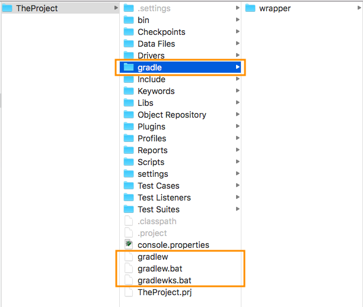
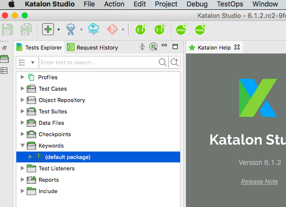
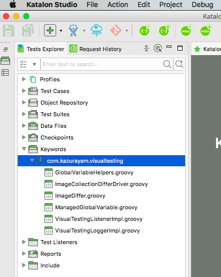
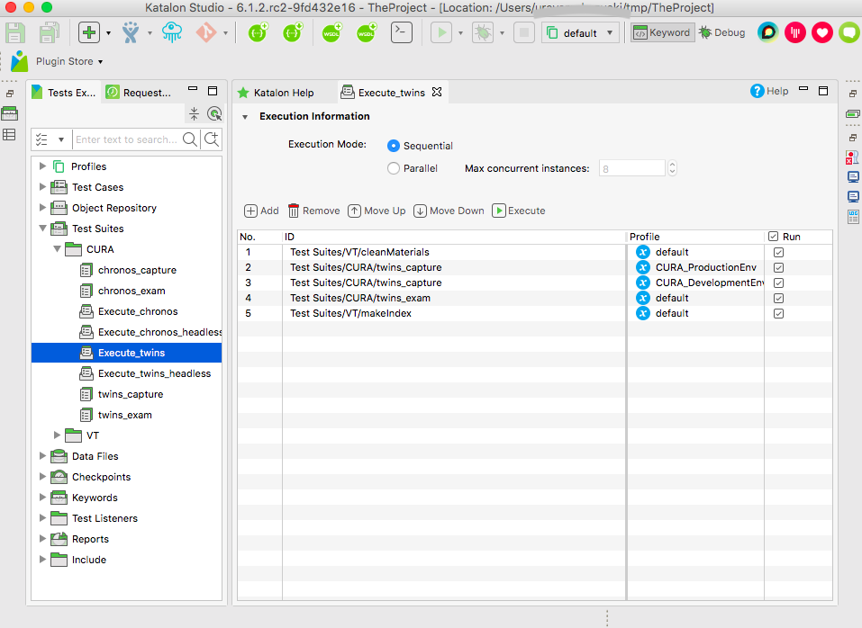
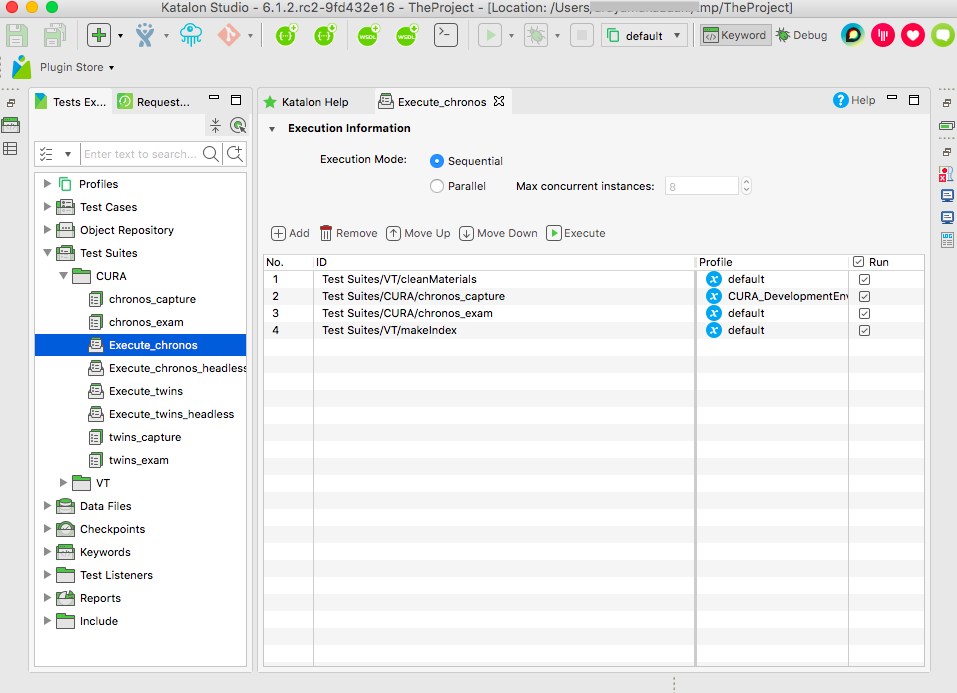

User Guide of Gradle Plugin com.github.visualtestinginks
==================================================

author: kazurayam
date: April, 2019

This document describes:
1. how to import resources of "VisualTestingInKatalonStudio" into your own Katalon Studio project
2. how to run the Example of Visual Testing

## Prerequisite

1. I tested the procedure here using Katalon Studio v6.1.2. But the procedure is expected to be independent of the Katalon version.
2. The procedure here uses Java Runtime Environment. If you are on Mac or Linux, JDK is preinstalled and you can rely on it. If you are on Windows, you can either install JDK8, or rely on the JRE bundled in Katalon Studio installed on your PC. How to? Will explain later.
3. If you are behind an organiation's Proxy, you need to tell Gradle how to go through the Proxy. See [Gradle docs](https://docs.gradle.org/current/userguide/build_environment.html#sec:accessing_the_web_via_a_proxy). Possibly the best way is to make `gradle.properties` file under the Users HOME directory. For example in Windows 10, you want to make `C:\Users\yourName\.gradle\gradle.properties` file, of which contents would be something like the following:
```
systemProp.http.proxyHost=172.24.X.X
systemProp.http.proxyPort=8080
systemProp.http.proxyUser=userid
systemProp.http.proxyPassword=password
systemProp.http.nonProxyHosts=*.nonproxyrepos.com|localhost
```


## How to import the components

### 1) Create new Katalon Studio Project

You create your own Katalon Studio project by Katalon Studio GUI just as usual.

I will write `%TheProject%` to mean the project directory for short.

### 2) Inject Gradlew tool into Katalon project

If you are willing to install JDK8 and Gradle Build tool, just follow the official instruction at https://gradle.org/install/.

Here I will describe alternative way of using [Gradle Wrapper](https://docs.gradle.org/current/userguide/gradle_wrapper.html).

Using browser, open https://github.com/kazurayam/VisualTestingInKatalonStudio/releases

Download `distributable-gradlew-X.X.X.zip` from the Releases page. Here `X.X.X` means the latest version number of the *VisualTestingInKatalonStudio* project. As of May 2019, X.X.X is `1.10.1`.

Unzip the downloaded file and deploy the contained files into `%TheProject%`. You will find the following files and a directory added into the directory: 

```
TheProject
├── gradle
│   └── wrapper
│       ├── gradle-wrapper.jar
│       └── gradle-wrapper.properties
├── gradlew
├── gradlew.bat
├── gradlewks.bat
```
### 3) Create build.gradle in your project root dir

You want to create `%TheProject%\build.gradle` file. The content should be as follows:


```
plugins {
  id "com.github.kazurayam.visualtestinginks" version "0.1.6"
}

vt.version = '1.10.2'
```


The Gradle Plugin `com.github.kazurayam.visualtestinginks` is shared at https://plugins.gradle.org/plugin/com.github.kazurayam.visualtestinginks. The latest version as of April 2019 is `0.1.3` but it may change in future. Please specify the lastest version of the time.

The line of `vt.version = '1.10.0'` specifies the version of *VisualTestingInKatalonStudio* project shared at https://github.com/kazurayam/VisualTestingInKatalonStudio/releases. The latest version as of April 2019 is `1.10.0` but it may change in future. Please specifiy the latest version of the time.

A working example of `build.gradle` file in a Katalon Studio project is here: https://github.com/kazurayam/visualtestinginks-gradle-plugin-test-application/blob/master/build.gradle .

### 4) Running the `enableVisualTesting` task

#### On Mac and Linux

On Mac and Linux, possibly you have JDK bundled in the OS, so you can just execute in the command line:
```
$ cd $TheProject
$ dos2unix ./gradlew
$ chmod +x ./gradlew
$ ./gradlew enableVisualTesting
```
A comment on this:
1. `doc2unix` command is required to convert the EndOfLine character CR+LF to LF (Windows style to Unix style)

#### On Windows with JDK installed

Almost the same as Mac, you can do on Windows:

```
$ cd %TheProject%
$ .\gradlew enableVisualTesting
```

#### On Windows without JDK installed

If you are on Windows and have no JDK installed, then you can use the JRE bundled in the Katalon Studio. Here I assume you have installed the Katalon studio at `C:\Users\yourName\Katalon-Studio-6.1.2`, then you can do:
```
$ set KATALONSTUDIO_HOME=C:\Users\yourName\Katalon-Studio-6.1.2
$ cd %TheProject%
$ .\gradlewks enableVisualTesting
```

### 5) How the your Katalon project is changed

The `enableVisualTesting` task will do 3 things:

1. download `vt-components-X.X.X.zip` from the [Releases of VisutalTestingInKatalonStudio project](## How to import resources of "VisualTestingInKatalonStudio" into your own project
) and deploy the contents into the TheProject's root directory. This zip contains a set of sharable resources (Test Cases, Test Suites, Test Listener, Keywords) that implement the feature of screenshot-comparison testing.
```
.
├── Keywords
│   └── com
│       └── kazurayam
│           └── visualtesting
│               ├── GlobalVariableHelpers.groovy
│               ├── ImageCollectionDifferDriver.groovy
│               ├── ImageDiffer.groovy
│               ├── ManagedGlobalVariable.groovy
│               ├── VisualTestingListenerImpl.groovy
│               └── VisualTestingLoggerImpl.groovy
├── Scripts
│   └── VT
│       ├── backupCurrentTSuiteResult
│       ├── cleanMaterials
│       ├── makeIndex
│       ├── reduceStorageSize
│       ├── restorePreviousTSuiteResult
│       └── utils
│           ├── backupAll
│           ├── emptyStorage
│           ├── executeSystemCommandExample
│           ├── listRepository
│           ├── listStorage
│           └── skelton
├── Test Cases
│   └── VT
│       ├── backupCurrentTSuiteResult.tc
│       ├── cleanMaterials.tc
│       ├── makeIndex.tc
│       ├── reduceStorageSize.tc
│       ├── restorePreviousTSuiteResult.tc
│       └── utils
│           ├── backupAll.tc
│           ├── emptyStorage.tc
│           ├── executeSystemCommandExample.tc
│           ├── listRepository.tc
│           ├── listStorage.tc
│           └── skelton.tc
├── Test Listeners
│   └── VTListener.groovy
├── Test Suites
│   └── VT
│       ├── cleanMaterials.groovy
│       ├── cleanMaterials.ts
│       ├── makeIndex.groovy
│       └── makeIndex.ts
```
2. download `vt-example-X.X.X.zip` from the [Releases of VisutalTestingInKatalonStudio project](## How to import resources of "VisualTestingInKatalonStudio" into your own project
) and deploy the contents into the TheProject's root directory. The zip contains a set of resources (Test Cases, Test Suites, Object Repository, Execution Profiles) which performs screenshot-comparison testing against the Katalon Demo site (http://demoaut.katalon.com).
```
.
├── Object Repository
│   └── CURA
│       ├── Page_Appointment
│       │   ├── button_Book Appointment.rs
│       │   ├── h2_Make Appointment.rs
│       │   ├── input_hospital_readmission.rs
│       │   ├── input_programs.rs
│       │   ├── input_visit_date.rs
│       │   ├── select_Tokyo CURA Healthcare C.rs
│       │   └── textarea_comment.rs
│       ├── Page_AppointmentConfirmation
│       │   ├── a_Go to Homepage.rs
│       │   ├── p_comment.rs
│       │   ├── p_facility.rs
│       │   ├── p_hospital_readmission.rs
│       │   ├── p_program.rs
│       │   └── p_visit_date.rs
│       ├── Page_Homepage
│       │   └── a_Make Appointment.rs
│       └── Page_Login
│           ├── button_Login.rs
│           ├── input_password.rs
│           └── input_username.rs
├── Profiles
│   ├── CURA_DevelopmentEnv.glbl
│   ├── CURA_ProductionEnv.glbl
│   └── default.glbl
├── Scripts
│   ├── CURA
│       ├── ImageDiff_chronos
│       ├── ImageDiff_twins
│       ├── Login
│       ├── restorePrevisousScreenshots
│       ├── test
│       │   ├── LoginTest
│       │   └── TC1
│       └── visitSite
├── Test Cases
│   ├── CURA
│       ├── ImageDiff_chronos.tc
│       ├── ImageDiff_twins.tc
│       ├── Login.tc
│       ├── restorePrevisousScreenshots.tc
│       ├── test
│       │   ├── LoginTest.tc
│       │   └── TC1.tc
│       └── visitSite.tc
├── Test Suites
│   ├── CURA
│       ├── Execute_chronos.ts
│       ├── Execute_chronos_headless.ts
│       ├── Execute_twins.ts
│       ├── Execute_twins_headless.ts
│       ├── chronos_capture.groovy
│       ├── chronos_capture.ts
│       ├── chronos_exam.groovy
│       ├── chronos_exam.ts
│       ├── twins_capture.groovy
│       ├── twins_capture.ts
│       ├── twins_exam.groovy
│       └── twins_exam.ts
├── vt-run-CURA-chronos.bat
├── vt-run-CURA-chronos.sh
├── vt-run-CURA-twins.bat
└── vt-run-CURA-twins.sh
```
3. download the External libraries that the project depnds upon. The libraries are deployed in the `%TheProject%\Drivers` directory.
  - `Materials-X.X.X.jar` from [it's Releases page on GitHub](https://github.com/kazurayam/Materials/releases)
  - `ashot-1.5.4.jar` from [Maven Central Repository](https://mvnrepository.com/artifact/ru.yandex.qatools.ashot/ashot/1.5.4).
  - a few more jars are downloaded.
  ```
  .
  ├── Drivers
  │   ├── vt-Materials-0.68.2.jar
  │   ├── vt-ashot-1.5.4.jar
  │   ├── vt-commons-lang3-3.6.jar
  │   ├── vt-commons-math3-3.6.1.jar
  │   ├── vt-junit4ks-all.jar
  │   ├── vt-ksbackyard.jar
  │   └── vt-thumbnailator-0.4.8.jar
  ```

You can find the list of URL of dependencies in the source of  [com.kazurayam.visualtestinginks.gradle.VTPluginExtension](https://github.com/kazurayam/visualtestinginks-gradle-plugin/blob/master/src/main/groovy/com/kazurayam/visualtestinginks/gradle/VTPluginExtension.groovy)

## How to make Katalon Studio aware of imported resources

After you imported the resources, you start Katalon Studio and the `TheProject`. The you will find the project is not ready to run screenshot-comparison tests.

Please select `Keywords` in the Tests Explorer in Katalon Studio GUI. You may expect the imported packages to appear here, but in fact not. It will show the default package with empty contents.


Katalon Studio needs a trigger to get aware of imported resources into the project space.

In the tool bar of Katalon Studio GUI, please choose `Project > Reflesh`.


Do Reflesh **twice**. I do not know why one click of Reflesh button is not enough. Just do it 2 times. Then the imported keywords should come up.


Now all of imported Groovy sources are compiled into *.class format and have got ready to run.

## How to run the example `CURA` tests

Now you are able to run the example tests in `TheProject`.

### Demo of Twins test

`Test Suites/CURA/Execute_twins` takes screenshots of 2 URLs.
1. [`http://demoaut.katalon.com/`](http://demoaut.katalon.com/)
2. [`http://demoauto-mimic.kazurayam.com/`](http://demoaut-mimic.kazurayam.com/)

These 2 URL has different host name. The pages look similar but not quite identical.

After screenshots are taken, the `Execute_twins`
 script compares the screenshot of `demoaut-mimic.kazurayam.com` against `demoaut.katalon.com` to find visual differences. When done, the difference is reported in the `%TheProject%\Materials\index.html` file. Please have a look at it with any browser of your choice.

### Demo of Chronos test

`Test Suites/CURA/Execute_chronos` takes a set of screenshots of a single URL:
1. [`http://demoauto-mimic.kazurayam.com/`](http://demoaut-mimic.kazurayam.com/)

After current screenshots are taken, the `Execute_chronos` script makes backup of the current screenshots into the `Storage` directory. And also the script looks up another set of previous screenshots and copies it from the `Storage` directory  to `Materials` directory. Finally the script compares the current set of screenshots against the one previously taken. The report is found at `%TheProject%\Materials\index.html` file.

The `Chronos` test verifies how much the current Application Under Test is different from the previous record. The `Chronos` test is usefull for asserting the status of AUT before/after any administrative changes (application software upgrades, OS patches, DB data changes, network device reconfiguration, etc).

 

## How to develop your own Visual Testing?

This issue is explained in the [README of VisualTestingInKatalonStudio project](https://github.com/kazurayam/VisualTestingInKatalonStudio).
